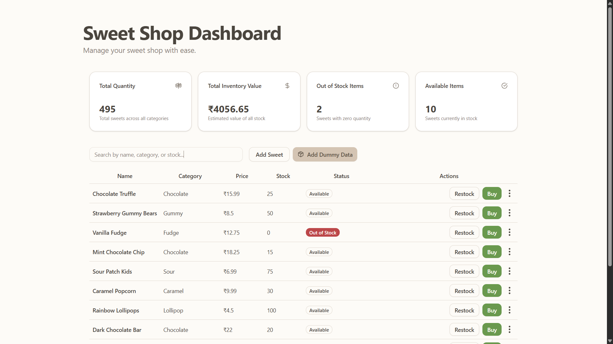
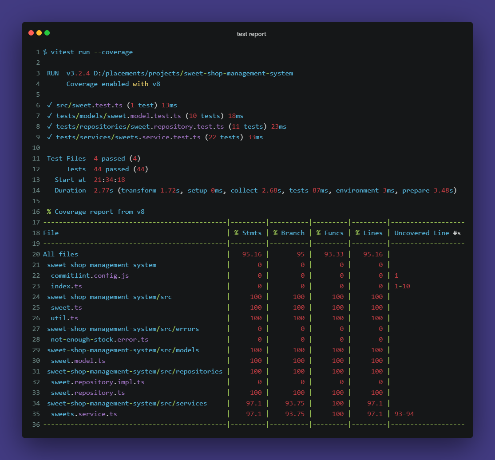

# Sweet Shop Management System

https://sweet-shop-kata.pages.dev/

A TypeScript-based inventory management system for sweet shops built following Test-Driven Development (TDD) principles. This system allows users to manage sweet inventory, handle purchases, and perform inventory operations with full CRUD functionality.

## Features

## Tech Stack

### Backend

- **Runtime**: Bun
- **Language**: TypeScript
- **Testing**: Built-in test runner
- **Code Quality**: ESLint, Prettier
- **Git Hooks**: Husky for pre-commit validation
- **CI/CD**: GitHub Actions for automated releases

### Frontend (UI)

- **Framework**: React 19
- **Language**: TypeScript
- **Build Tool**: Vite
- **Styling**: Tailwind CSS v4
- **UI Components**: Radix UI primitives
- **Icons**: Lucide React
- **Theming**: next-themes
- **Notifications**: Sonner
- **Dev Tools**: ESLint, TypeScript compiler

  ### Screenshots

  

  UI screenshots are available in the [`screenshots/`](./sreenshots/) folder.

  You can view more screenshots in the folder.

  -**△**: for search and filtering current frontend not uses methods provided by backend instead uses JavaScript's native array methods (due to limited time)

## Project Structure

```text
sweet-shop-management-system/
├── src/
│   ├── models/          # Data models and interfaces
│   ├── repositories/    # Data access layer
│   ├── services/        # Business logic layer
│   ├── errors/          # Custom error classes
│   ├── sweet.ts         # Main sweet entity
│   ├── sweet.test.ts    # Sweet entity tests
│   └── util.ts          # Utility functions
├── ui/                  # React frontend application
│   ├── src/
│   │   ├── components/  # Reusable UI components
│   │   │   └── ui/      # Base UI components (buttons, inputs, etc.)
│   │   ├── lib/         # Utility functions and main components
│   │   ├── assets/      # Static assets
│   │   ├── App.tsx      # Main application component
│   │   ├── main.tsx     # Application entry point
│   │   ├── index.css    # Global styles and Tailwind imports
│   │   └── App.css      # Component-specific styles
│   ├── public/          # Public assets
│   ├── index.html       # HTML template
│   ├── vite.config.ts   # Vite configuration
│   ├── tsconfig.json    # TypeScript configuration
│   └── package.json     # UI dependencies and scripts
├── tests/               # Test files organized by layer
├── coverage/            # Test coverage reports
├── sreenshots/          # UI screenshots
├── .github/workflows/   # CI/CD configuration
├── .husky/             # Git hooks
├── index.ts            # Main export file
└── package.json        # Root dependencies and scripts
```

## Getting Started

### Prerequisites

- [Bun](https://bun.sh/) installed on your system

### Installation

1. Clone the repository:

```bash
git clone <repository-url>
cd sweet-shop-management-system
```

2. Install dependencies:

```bash
bun install
```

3. Run tests:

```bash
bun test
```

4. Start ui:

```bash
cd ui & bun install
```

5. Start ui:

```bash
bun run dev
```

- if you want to run ui from root run following command

```base
bun run start
```

## Development Workflow

This project follows **Test-Driven Development (TDD)** principles:

1. **Red**: Write a failing test
2. **Green**: Write minimal code to make the test pass
3. **Refactor**: Improve code while keeping tests green

### Running Tests

```bash
# Run all tests
bun test

# Run tests in watch mode
bun test --watch

# Run specific test file
bun test src/sweet.test.ts

# Generate coverage report
bun test --coverage
```

### Test Coverage



Current test coverage: **95.16%** overall coverage with comprehensive testing across all layers.

### Code Quality

```bash
# Lint code
bun run lint

# Format code
bun run format

# Type check
bun run typecheck
```

## API Reference

- index.ts exports the createSweetShop() function, designed for easy integration into other projects.
- Native API Usage: This project leverages direct function calls to the SweetShop API, providing better performance and type safety compared to HTTP-based APIs, which introduce network overhead and latency.

### Sweet Model

```typescript
interface Sweet {
  id: string;
  name: string;
  category: "chocolate" | "candy" | "pastry";
  price: number;
  quantity: number;
}
```

## UI

The user interface is located in the [`ui/`](./ui/) folder.

- First created with Svelte but Svelte has no reactive support for Map properties
- Final UI created in React
- Some components rewritten using old Svelte files with help from v0

## Future Improvements

- **UI Enhancements**: Fix type and linting errors in the UI components
- **Error Handling**: Implement comprehensive error handling throughout the application
- **Persistent Memory**: Add data persistence capabilities to maintain state between sessions
- **Use Methods Provided by Backend**: use methods provided by backend for search, filtering.

## Testing Strategy

- **Unit Tests**: Test individual components in isolation
- **Integration Tests**: Test component interactions
- **Error Scenarios**: Test error handling and edge cases
- **High Coverage**: Aim for comprehensive test coverage

## AI Usage

This project encourages the use of AI tools in the Software Development Life Cycle (SDLC). AI-assisted commits are marked separately for transparency.

---
